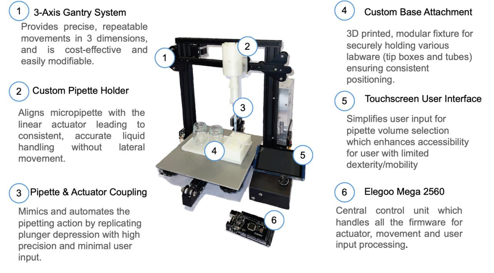
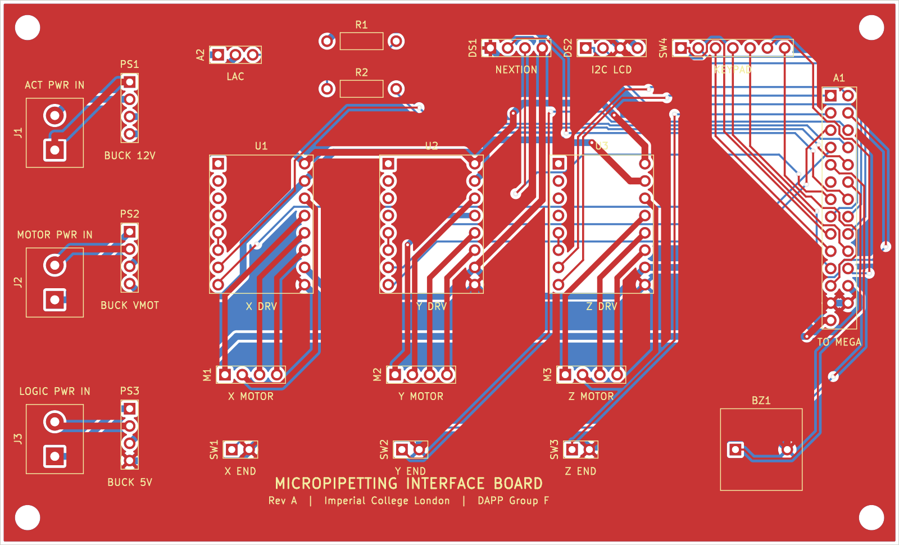

# Automated Micropipetting System - Gantry + Linear Actuator + Touchscreen

A low-cost, bench-top pipetting robot that lets users with tremors, fatigue or limited upper-limb mobility pipette independently. A modified Ender-3 gantry positions an actuator-driven 3D-printed micropipette over labware, and the whole run is set up from a Nextion touchscreen: pick a source, the destination wells and a volume, then press start.

Built as the Design & Prototyping group project built by nine second-year Molecular Bioengineering students at Imperial College London, supervised by Dr Ian Radcliffe.

> ❗️**Prototype, not a certified lab instrument.** Accuracy was validated on the bench only. Don't use it for regulated or clinical work.



---

## Features
- **3-axis Cartesian gantry** built on a Creality Ender-3 frame, with A4988 drivers and end-stop homing on every axis.
- **Coordinated XY motion** using Bresenham-style interpolation, so both axes arrive together. Z always retracts to a safe height before any travel.
- **Actuator-driven pipette.** A 12 V linear actuator presses the plunger of an open-source, ISO 8655-compliant 3D-printed micropipette.
- **Touchscreen workflow.** Source → wells → volume → start on a 4.3" Nextion HMI, with input validation done on the display.
- **Tactile keypad** (4×3) as an alternative input, plus a **buzzer** for audio feedback at the start and end of each job.
- **Modular PLA base** with a 5×8 tube rack and two beaker slots in fixed, grooved positions.
- **£483.53** material cost, against more than £35,000 for commercial liquid handlers.

---

## Hardware
- Elegoo Mega 2560 R3 (Arduino Mega compatible)
- Creality Ender-3 3D printer (frame, rails, NEMA17 steppers, end-stops, PSU)
- 3 × A4988 stepper driver modules
- Actuonix Linear Actuator Control (LAC) board + linear actuator
- 3D-printed adjustable micropipette (3 mL syringe) + custom pipette/actuator holder
- Nextion NX4827T043 4.3" HMI touchscreen + microSD card
- 4×3 membrane keypad, piezo buzzer
- 3 × LM2596 buck converters, custom interface PCB

Full part list with suppliers and prices: [`hardware/BOM.csv`](hardware/BOM.csv).

### Interface PCB
A 2-layer, 132 × 80 mm board that carries the three A4988 drivers, power inputs and all device connectors, with a 2×14 header to the Mega. KiCad files and Gerbers are in [`hardware/`](hardware/).



> The layout in this repo is a 2026 reconstruction from the report schematic, not the original files sent to JLCPCB. See [`hardware/README.md`](hardware/README.md#board-layout).

### Power
- Mains supplies the Ender-3 PSU (24 W total draw).
- **12 V rail** (via buck converter) powers the LAC board and actuator.
- **5 V rail** (via buck converters) powers the Mega, the A4988 logic and the Nextion.
- A separate buck converter supplies the stepper motor voltage (VMOT).

> Set every LM2596 output with a multimeter **before** connecting anything. They ship at arbitrary voltages.

---

## Pinout / Wiring

| Component | Signal | Mega Pin |
|---|---|---|
| X axis | STEP / DIR / End-stop | **6** / **7** / **5** |
| Y axis | STEP / DIR / End-stop | **9** / **10** / **8** |
| Z axis | STEP / DIR / End-stop | **12** / **13** / **11** |
| LAC board | VC (position signal) | **4** (via R2, with R1 pull-up) |
| Nextion | RX / TX | **TX1 (18)** / **RX1 (19)** |
| Keypad | Rows / columns | **22, 24, 26, 28, 30, 32, 34** |
| Buzzer | + | **2** |
| A4988 | VDD / VMOT | 5V / motor buck output |
| A4988 | SLP ↔ RST | Tied together |
| End-stops | Switch → GND | `INPUT_PULLUP`, triggered = `HIGH` |

> Note: the report's schematic figure shows DIR/STEP swapped, the buzzer on D52 and the Nextion on TX0/RX0. The table above follows the firmware, which is what actually ran. Full schematic: [`hardware/pcb_design.kicad_sch`](hardware/pcb_design.kicad_sch).

---

## Software Requirements
Arduino IDE 1.8+ or Arduino IDE 2.x. **No external libraries** are needed. The sketch only uses the Arduino core (`Serial`, `Serial1`, `tone()`).

For the touchscreen:
- **Nextion Editor** to edit the `.HMI` and compile the `.tft`.

---

## Installation
1. **Clone the repository**
   ```bash
   git clone https://github.com/your-username/automated-micropipetting-system.git
   cd automated-micropipetting-system
   ```
2. Wire the system per the pin table above, and set the A4988 current limits and buck converter voltages.
3. Open `firmware/pipetting_controller/pipetting_controller.ino` in the Arduino IDE.
4. Select **Board → Arduino Mega or Mega 2560** and the correct port.
5. **Verify/Compile**, then **Upload**.
6. Copy the Nextion `.tft` to a FAT32 microSD card, insert it into the display and power it on to flash.
7. (Optional) Open **Tools → Serial Monitor** at **9600 baud** to watch the job logs.

---

## Configuration

Edit these constants near the top of the sketch. All positions are in **steps from home**:

```cpp
const long Z_SAFE_HEIGHT = 1700;   // travel height between positions
const long Z_WORK_HEIGHT = 300;    // tip-in-liquid height
unsigned long stepDelayXY = 1500;  // µs, XY step half-period (lower = faster)
unsigned long stepDelayZ  = 1200;  // µs, Z step half-period
const long MAX_HOMING_STEPS_Z = MAX_BACKWARD_Z + 100;  // Z homing timeout
```

Labware positions come from calibration and must be re-measured if the base changes:
```cpp
Coord wells[]   = { { 890, 500 }, { 940, 500 }, ... };  // 5×8 rack, 50-step pitch
Coord beakers[] = { { 400, 700 }, { 670, 700 } };       // left, right
```

Step resolution (from calibration):
- **X:** ~0.199 mm/step
- **Y:** ~0.205 mm/step
- **Z:** 0.04 mm/step

---

## How It Works

1. **Homing**  
   At power-up, each axis drives toward its end-stop (X → Y → Z) to set an absolute zero. Z then rises to `Z_SAFE_HEIGHT`.

2. **Job Entry**  
   The user steps through the Nextion screens (source type → beaker or input well → output wells → volume). The display checks the inputs, then sends a single packet over `Serial1`, terminated by `#`.

3. **Packet Parsing**  
   `parsePacket()` decodes the ASCII fields (`I=` input well, `O=` output wells) and the 4-byte little-endian fields (`V=` volume, `B=` beaker side, `T=` source type), then plays a confirmation beep.

4. **Execution**  
   The gantry travels to the source and then to each output well in turn. At every stop, `holdZatWorkHeight()` lowers the tip, dwells for 3 s, then retracts. Z always returns to safe height before any XY move.

5. **Return**  
   The head goes back to (0, 0), the end melody plays, and the buffer clears ready for the next job.

---

## Usage

1. Plug in the system and wait for homing to finish.
2. Fill the source beaker or tubes and place them in the marked slots. Fit a fresh tip.
3. On the touchscreen, choose **Beaker** or **Tubes**, then pick the source.
4. Tap the output wells and press **Confirm**.
5. Enter the volume in µL and tap **Start Pipetting**.
6. Two beeps confirm the job, and a melody plays when the head is back home.
7. Remove the tip by hand. There is no auto-eject yet.

Full walkthrough with screenshots: [`docs/user-guide.md`](docs/user-guide.md).

---

## Data Output

### Serial Monitor (9600)
```
Ready to receive Nextion packets...
Input Well: 0
Output Wells: 12,13,14,
Volume: 74
Beaker Side: 1
Source Type: 1
```

### Nextion Packet Format
```
T=<4B> B=<4B> I=<digits> O=<d>,<d>,...; V=<4B> #
```
| Field | Meaning |
|---|---|
| `T` | Source type: 1 = beaker, 2 = tubes |
| `B` | Beaker side: 1 = left, 2 = right |
| `I` | Input well index (0–39) |
| `O` | Output well indices, `;`-terminated |
| `V` | Volume in µL |

### Debug Commands (USB Serial)
| Command | Action |
|---|---|
| `X0` | Re-home X |
| `Y0` | Re-home Y |
| `Z0` | Re-home Z |

---

## Results

- **Volume accuracy:** the pipette alone was calibrated to within ±1% of target. The actuator adds extra uncertainty at system level, and accuracy drops at low volumes.
- **Cross-contamination:** no visible carryover in dye-then-clear runs with tip changes. This was checked by eye only.
- **Gantry:** the step-to-distance response is linear on all axes ([calibration](docs/calibration.md)).
- **User testing (n = 20):**
  - 90% rated lab fit 4–5/5.
  - 75% needed minimal or no instructions.
  - The top requests were a bigger screen, larger touch targets and tactile buttons.

Full evaluation: [`docs/testing.md`](docs/testing.md).

---

## Troubleshooting

- **An axis runs into the frame during homing**
  - Check the end-stop wiring and that it reads `HIGH` when pressed (`LIMIT_PRESSED = HIGH`).
  - XY homing has no step limit. Cut power or press reset if a switch fails.

- **The touchscreen does nothing when you press Start**
  - Nextion TX must go to Mega **RX1 (19)** and Nextion RX to **TX1 (18)**. The crossover matters.
  - Both sides need to be at **9600 baud**.
  - Check that the packet ends with `#`. Watch the Serial Monitor for the `Input Well:` lines.

- **The tip misses the wells**
  - Re-home with `X0` / `Y0` / `Z0`. Position isn't re-homed between jobs, so lost steps accumulate.
  - Re-measure `wells[]` / `beakers[]` if the base has moved.

- **A motor stutters, skips or runs hot**
  - Re-set the A4988 current limit on the trim pot.
  - Increase `stepDelayXY` / `stepDelayZ` to slow the motion.
  - Check that VMOT is present and the driver has airflow or a heatsink.

- **A motor runs backwards**
  - Swap one coil pair (1A/1B) on that driver.

- **The tip doesn't reach the liquid, or it crashes into the tube bottom**
  - Adjust `Z_WORK_HEIGHT`.

---

## Notes & Limitations
- **The volume isn't used by the firmware yet.** `V=` is parsed and logged, but this sketch doesn't generate the actuator PWM. Actuation happens outside this file.
- **16-bit `int` on AVR.** The 4-byte field decoding shifts by 16 and 24 bits, which overflows a 16-bit `int`. It works only because the upper bytes are zero. It should use `int32_t`.
- **Everything is blocking.** There's no cancel or emergency stop mid-job.
- **The keypad isn't implemented here.** It is wired, but this sketch doesn't read it.
- **Tips are ejected manually.** Servo-driven ejection and a tip bin are on the roadmap.
- **Materials.** PLA parts suit prototyping only. The pipette–carriage joint needs a stiffer mount.
- **The volume range is inconsistent across sources.** The spec says 100–1000 µL, the UI guide 10–100 µL, and testing covered 30–100 µL.

More detail: [`firmware/README.md`](firmware/README.md#known-issues).

---

## Project Structure

```
automated-micropipetting-system/
├── firmware/
│   ├── pipetting_controller/
│   │   └── pipetting_controller.ino   # Gantry, homing, Nextion packet parser
│   └── README.md                      # Pinout, protocol, known issues
├── hardware/
│   ├── pcb_design.kicad_pro           # KiCad project
│   ├── pcb_design.kicad_sch           # Schematic
│   ├── pcb_design.kicad_pcb           # Board layout (reconstructed)
│   ├── pcb_design_gerbers.zip         # Gerbers + drill files
│   ├── apms.pretty/                   # Project footprint library
│   ├── pcb_design.pdf                 # Plotted schematic
│   ├── schematic.png                  # Original figure from the report
│   ├── BOM.csv                        # Bill of materials (£483.53)
│   ├── tools/                         # Schematic + board generation scripts
│   └── README.md                      # Power rails, drivers, wiring
├── hmi/
│   └── README.md                      # Nextion screen flow
├── cad/
│   └── README.md                      # SolidWorks parts (base, holders)
├── docs/
│   ├── images/                        # Figures
│   ├── calibration.md                 # Gantry step calibration
│   ├── testing.md                     # Accuracy, contamination, user testing
│   ├── user-guide.md                  # Operating instructions
│   └── final-report.pdf               # Full project report
└── README.md
```

---

## Team
Ben Jones · Jenna du Preez · Kailin Wang · Leonardo Grimaldi · **Sean Obi** · Sheena Ling · Sumaiyah Zaman · Tayeb Tadlaoui · Yasmine Marenzi

### My Contributions (Sean Obi)
- **PCB design.** Designed the custom interface PCB (schematic and layout), manufactured by JLCPCB.
- **Electronics lead.** System wiring and power distribution (12 V actuator rail, 5 V logic), and integration of the drivers, LAC board, keypad, display and buzzer.
- **Firmware.** Co-developed the Arduino controller: homing, XY motion and Nextion packet handling.
- **Gantry.** Assembled the Ender-3 conversion.
- **User testing.** Coordinated the n = 20 study.
- **Final report.** Co-authored it.

---

## Acknowledgements
- Dr Ian Radcliffe (supervisor)
- Imperial Disability Advisory Services and Dr Katherine Dean
- Ms Iris Latham (disability consultant) and Dr Tweety Tang (user-testing sessions)
- Brennan, Bokhari & Eddington: *Open Design 3D-Printable Adjustable Micropipette that Meets the ISO Standard for Accuracy* (Micromachines, 2018)
- Creality Ender-3 · Pololu A4988 · Actuonix LAC · Nextion Editor
