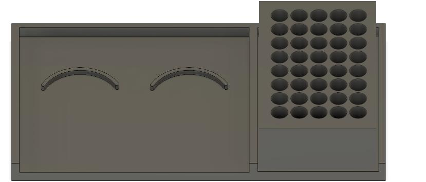

# CAD

The custom parts were designed in SolidWorks and printed in PLA using FDM. Add the `.SLDPRT` / `.SLDASM` sources and exported `.STL` files here:

| Part | Function |
|---|---|
| Base attachment | Bolts to the Ender-3 bed and holds labware in fixed, grooved slots |
| Microcentrifuge tube holder | 5×8 rack for 1.5 mL tubes, matching the `wells[]` grid in firmware |
| Pipette holder | Clamps the pipette to the X-carriage using the existing mounting holes |
| Actuator holder | Screws onto the pipette holder and keeps the actuator coaxial with the plunger |

The micropipette itself is the open-source design by Brennan, Bokhari & Eddington (Micromachines, 2018). Link to their files rather than re-hosting them, and check their licence terms.
