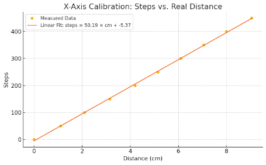

# Gantry calibration

---

## Method

1. A pencil was mounted in place of the pipette.
2. Each axis was driven in 50-step increments from 0 to 450 steps.
3. The resulting displacement was measured with a ruler.
4. A least-squares line was fitted to steps vs. distance.

---

## Results

| Axis | Fit | Steps/cm | mm/step |
|---|---|---|---|
| X | steps = 50.19·d − 5.37 | 50.19 | 0.199 |
| Y | steps = 48.77·d − 0.54 | 48.77 | 0.205 |
| Z | — | — | 0.04 |

The report table rounds these to 0.19 / 0.20 / 0.04 mm/step. No plot was produced for Z.

The response is linear across the full range, so a single scale factor per axis is enough. The firmware works in raw steps, so these factors are only needed to convert labware positions measured in mm into step coordinates.
