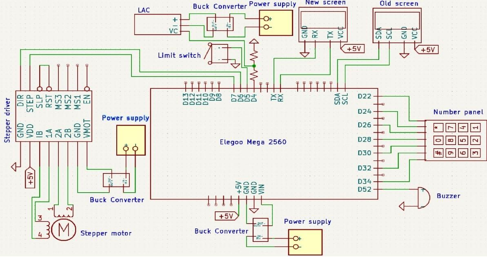

# Hardware

| File | Contents |
|---|---|
| `pcb_design.kicad_pro` | KiCad project (KiCad 7 format; opens in 7, 8 and 9) |
| `pcb_design.kicad_sch` | Schematic |
| `pcb_design.kicad_pcb` | Board layout (reconstructed; see below) |
| `pcb_design_gerbers.zip` | Gerbers and drill files exported from the reconstructed layout |
| `apms.pretty/`, `fp-lib-table` | Project footprint library |
| `pcb_design.pdf` | Plotted schematic |
| `schematic.png` | Original schematic figure from the report (Appendix F) |
| `tools/` | Scripts that generate the schematic and board |
| `BOM.csv` | Bill of materials |

---

## Board Layout

> **Reconstruction.** The original 2025 layout files and the Gerbers sent to JLCPCB aren't in this repo. This layout was rebuilt in 2026 from the report's schematic figure and auto-routed with Freerouting. It is electrically equivalent to the schematic, but it is not the board that was manufactured.

**Board**
- 132 × 80 mm, 2 layers, 1.6 mm thick, with four M3 mounting holes.
- GND pour on both layers.

**Track widths**
| Net class | Nets | Width |
|---|---|---|
| Power | GND, +5V, VMOT, actuator and logic supply | 1.0 mm |
| Motor | Stepper coils | 0.8 mm |
| Signal | Everything else | 0.3 mm |

The board passes KiCad DRC with **0 violations and 0 unconnected pads**.

**On-board**
- 3 × Pololu-format A4988 sockets (X/Y/Z)
- R1/R2 on the LAC control line
- Buzzer
- 3 × 5.08 mm screw terminals for the power inputs

**Connected by header**
- Motors (4-pin) and end-stops (2-pin)
- The three LM2596 modules (IN+, IN−, OUT+, OUT−)
- LAC board, Nextion, legacy I²C LCD (not fitted) and keypad
- A 2×14 **TO MEGA** header carrying every Mega signal

---

## Schematic

The `.kicad_sch` is redrawn from the report figure, with two changes:

1. **It shows all three axes.** The original figure shows one representative driver, motor and end-stop.
2. **Its pin assignments follow the firmware, which is what actually ran.** Where the report figure differs, the firmware wins:

| Signal | Report figure | Schematic / firmware |
|---|---|---|
| X DIR / STEP | D6 / D7 | D7 / D6 |
| Buzzer | D52 | D2 |
| Nextion | TX0 / RX0 | Serial1: TX1 (D18), RX1 (D19) |

Connectivity uses net labels, so every connection is explicit. Every symbol has a footprint from the project library, and **Tools → Update PCB from Schematic** matches the layout.

Before building from these files, check these points against the physical build:

- The values of R1 and R2 on the LAC control line are not given in the report.
- The keypad pin order onto D22–D34 is as drawn in the report.
- `VMOT_GND` and `LAC_V-` are left as separate returns, as drawn. Tie them to GND if the supplies share a ground.

---

## Power

| Rail | Source | Loads |
|---|---|---|
| Mains → 24 V | Ender-3 built-in PSU | Input to buck converters |
| 12 V | Buck converter (LM2596) | Linear actuator via LAC board |
| 5 V | Buck converters (LM2596) | Mega 2560, A4988 logic, Nextion display |
| Motor supply | Buck converter → A4988 VMOT | Stepper coils |

The system draws about 24 W in total.

**Before connecting anything**, set each LM2596 output with a multimeter. The modules ship at arbitrary voltages and will kill the Mega or the display if left unset.

---

## Stepper drivers

There are three A4988 carriers, one each for X, Y and Z (the BOM includes one spare). STEP and DIR go to the Mega (see [firmware pinout](../firmware/README.md#pinout)). Tie SLP and RST together high.

Set the current limit on each driver using the trim pot:

> V_ref = I_max × 8 × R_sense

Set it for the Ender-3's stepper motors (Creality 42-series), and check R_sense on your particular carrier.

---

## Actuator

The linear actuator is driven through an Actuonix Linear Actuator Control (LAC) board. The Mega sends a PWM/RC position signal to the LAC. The LAC closes the position loop and drives the actuator from the 12 V rail. The actuator's rod is mechanically coupled to the pipette plunger, as shown in the [pipette mechanism image](../docs/images/pipette-mechanism.png).

---

## I/O

- **Nextion display:** UART on Serial1 (TX1/RX1), powered from 5 V.
- **Keypad:** 4×3 matrix on D22–D34.
- **Buzzer:** D2.
- **End-stops:** the stock Ender-3 mechanical switches, one per axis.
- **Old I²C LCD:** still shown on the schematic but no longer used.

---

## Bill of materials

See [`BOM.csv`](BOM.csv). The total comes to **£483.53**. The two largest items are the Ender-3 (£139) and the custom PCB (£99.22).
