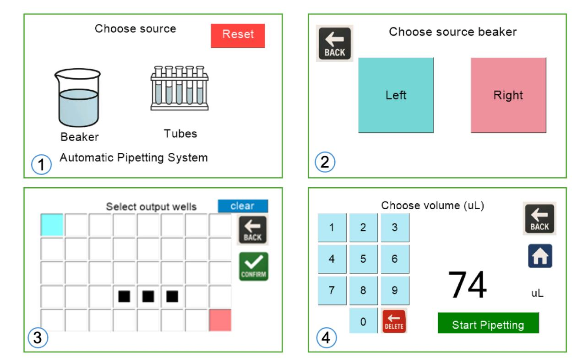

# Nextion HMI

The interface was built in the Nextion Editor for an NX4827T043 (4.3", 480×272, resistive touch). Place the project files here:

- `pipetting_ui.HMI`: the editable Nextion Editor source
- `pipetting_ui.tft`: the compiled file, loaded onto the display from a FAT32 microSD card

---

## Screen flow

| Page | Purpose | Sends |
|---|---|---|
| 0 – Choose source | Beaker or Tubes, plus Reset | `T=` |
| 1a – Source beaker | Left / Right (beaker path only) | `B=` |
| 1b – Input well | 5×8 grid, single select + Confirm (tubes path only) | `I=` |
| 2 – Output wells | 5×8 grid, multi-select, Clear / Confirm | `O=…;` |
| 3 – Volume | Numeric keypad, Delete, Start Pipetting | `V=` then `#` |

---

## Validation (done on the display)

- Exactly one input well is required, with a warning if none is selected.
- At least one output well is required.
- A well cannot be both input and output, and this is enforced even when navigating back.
- The volume must be within range, otherwise a warning appears briefly.

The UI colours follow the accessibility guidance from the Access All Areas in Labs project.

> **Note:** the user guide gives the on-screen volume range as 10–100 µL, and bench testing covered 30–100 µL, while the design specification targets 100–1000 µL. Check which limit is set in the `.HMI` before publishing.
